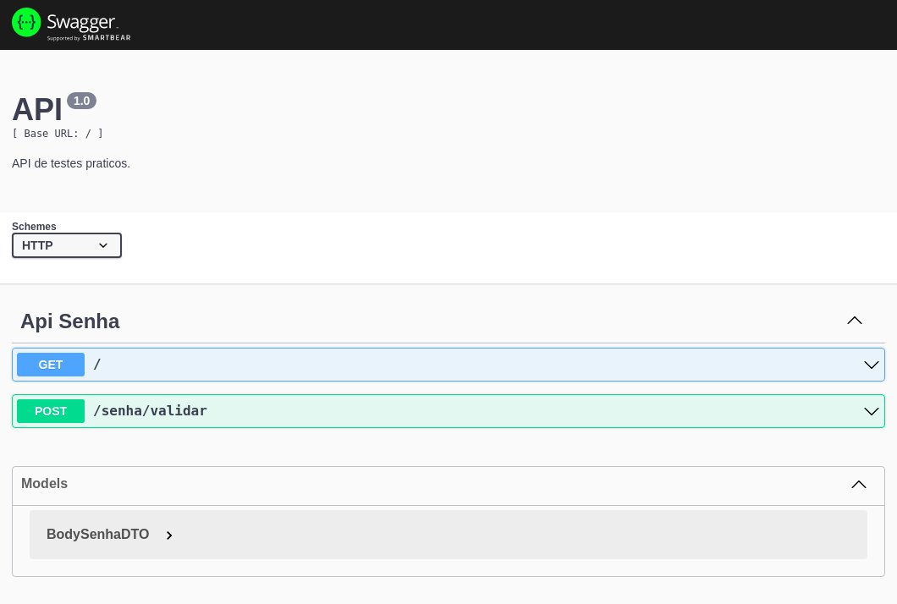

<h1 align="center">Api Testa Senha</h1>

<div align="center">

</div>


## 📝 Indice

- [Descrição](#descricao)
- [Como Usar](#como-usar)
- [Contruído com](#build)
- [Autor](#autor)

## Descricao <a name = "descricao"></a>
Implementar uma aplicação, que exponha uma api web, capaz de realizar validação de senhas as seguintes condições: 

- Nove ou mais caracteres
- Ao menos 1 dígito
- Ao menos 1 letra minúscula
- Ao menos 1 letra maiúscula
- Ao menos 1 caractere especial
- Considere como especial os seguintes caracteres: !@#$%^&*()-+
- Não possuir caracteres repetidos dentro do conjunto

## Como Usar <a name = "como-usar"></a>

Siga o passo a passo para executar a aplicação em um servidor local.

### Pré-requisitos
Antes de começar, você vai precisar ter instalado em sua máquina as seguintes ferramentas:
[Git](https://git-scm.com), [Node.js](https://nodejs.org/en/). 
Além disto é bom ter um editor para trabalhar com o código como [VSCode](https://code.visualstudio.com/)


No primeiro passo, clone o projeto:

```
api-valida-senhagit clone https://github.com/brenoaos/api-valida-senha.git
```

Navegue até a pasta da aplicação.
```
cd apiValidaSenha/app
```

Em seguida, será necessario instalar os modulos da aplicação. Para isso, execute o comando abaixo usando o seu gerenciador de pacotes:

yarn

```
yarn && yarn start
```
or 
npm

```
npm i && npm run start
```

O servidor inciará na porta: 3000 - <http://localhost:3000>


## 🎈 Uso <a name="usage"></a>

Acesse a [documentação](http://localhost:3000/api) da API.

<h1 align="center">

</h1>

## ⛏️ Construído com <a name = "build"></a>

- [TypeScript](https://www.typescriptlang.org/) - Linguagem
- [NextJs](https://nestjs.com/) - Server
- [Swagger](https://swagger.io/) - Api Documentation
- [NodeJs](https://nodejs.org/en/) - Runtime / JS Engine

## ✍️ Authors <a name = "authors"></a>

- [@brenoaos](https://github.com/brenoaos)
